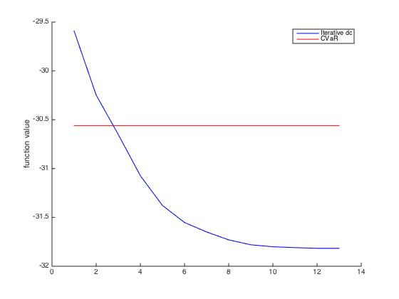

# Sequential Convex Approximations to Joint Chance Constrained Programs: A Monte Carlo Approach

## Introduction
This is a Matlab implementation of the sequential convex approximation algorithms for joint chance constrained problem. It includes a comparison between both conditional value-at-risk (CVaR) and sequential convex approximation for value-at-risk (Iterative dc).

## Using the code
Use Matlab to run `example_run.m` directly. You may expect to see the result figure below:

## Files explanation:
- `example_run.m`: runing file, first open
- `main_function.m`: including generating samples, apply cvar approximation, epsilon approximation and dc approximation, return results for a particular setting
- `gensample.m`: generate normal distributions for all random variables
- `obj_fun.m`: objective function
- `quantile.m`: quantile for constraints
- `opt_cvar.m, opt_dc.m, opt_eps.m`: optimization for cvar, one step dc approximation, epsilon approximation
- `con_fun_cvar.m, con_fun_dc.m, con_fun_eps.m`: constraints for cvar, one step dc approximation, epsilon approximation
- `lincave.m`: linear approximation for concave function

## Citation
    @article{hong2011sequential,
      title={Sequential convex approximations to joint chance constrained programs: A Monte Carlo approach},
      author={Hong, L Jeff and Yang, Yi and Zhang, Liwei},
      journal={Operations Research},
      volume={59},
      number={3},
      pages={617--630},
      year={2011},
      publisher={INFORMS}
    }
